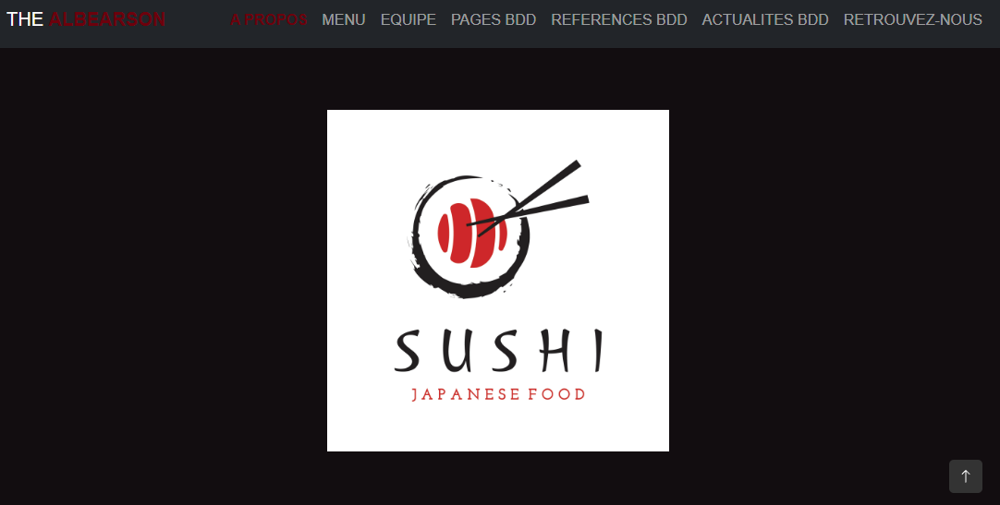
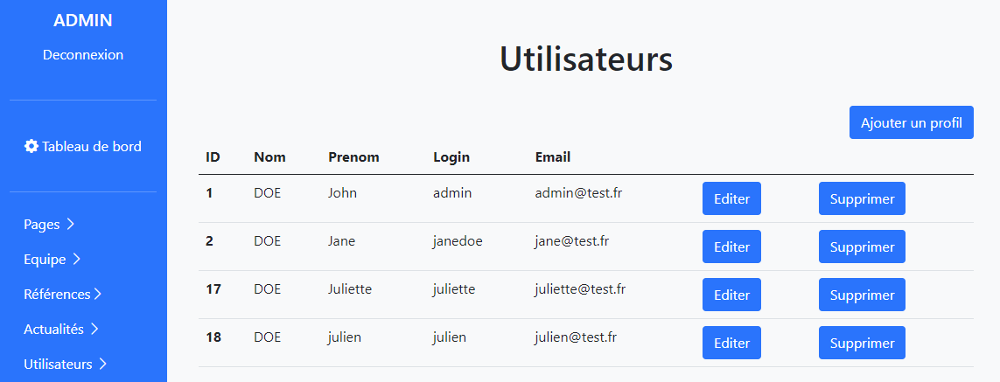
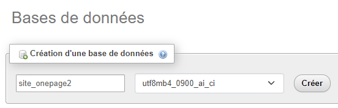
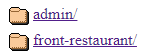
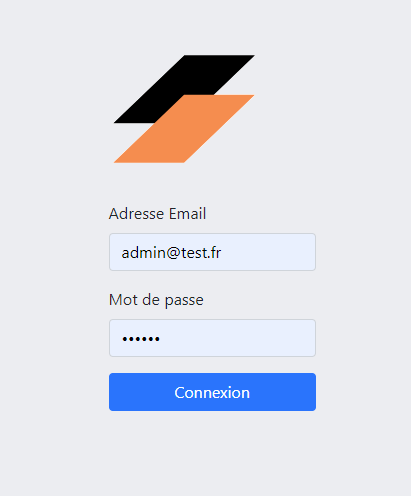

# :desktop_computer: Site Web

## Description

L’objectif ici était de créer un site web paramétrable. Cette application contient une partie front-office qui sera accessible au public afin que le client puisse présenter ses produits et/ou services. Il y a également une deuxième partie en back-office qui sera une interface admin. Celle-ci sera réservée uniquement au client, elle comportera au total 5 sections : pages, équipe, références, actualités et utilisateurs. Chacune d’entre elles contient un CRUD.

Aperçus des parties front-office et back-office

## Comment installer la base de données ?

Pour commencer vous devrez créer une nouvelle base de données dans le système de gestion de bases de données de votre choix (ici j'utilise phpMyAdmin). Son nom sera "site_onepage2" :

Dans le dossier BDD, vous retrouverez le fichier "site_onepage2.sql". Il contient 5 tables ainsi qu'un jeu d'essai. En l'important dans votre nouvelle base de données vous pourrez ainsi directement tester l'application.

## Comment utiliser l'application ?

Vous l'avez installé ? Parfait passons à la suite ! Le projet est séparé en deux dossiers distincts : "front-restaurant" et "admin".

En cliquant sur le lien "front-restaurant" vous pourrez accéder directement à la partie vitrine du site :

Celle-ci est (normalement) responsive, enfin j'espère :thinking:

Si vous choisissez le deuxième lien "admin" (ou si vous êtes déjà cliqué sur le premier lien, en remplaçant le "front-restaurant" par "admin" dans l'url) vous vous retrouverez directement sur la page connexion de l'interface admin :

Deux types d'utilisateurs auront accès à cette interface : les admins et les rédacteurs.

-> Si vous souhaitez vous connecter en tant qu'admin, voici les informations à donner :

Adresse email = admin@test.fr

Mot de passe = azerty

-> Ou si vous préférez vous connecter en tant que rédacteur :

Adresse email = jane@test.fr

Mot de passe = azerty

## Infos complémentaires

Version de PHP : 8.2.0

Version de phpMyAdmin : 5.2.0
